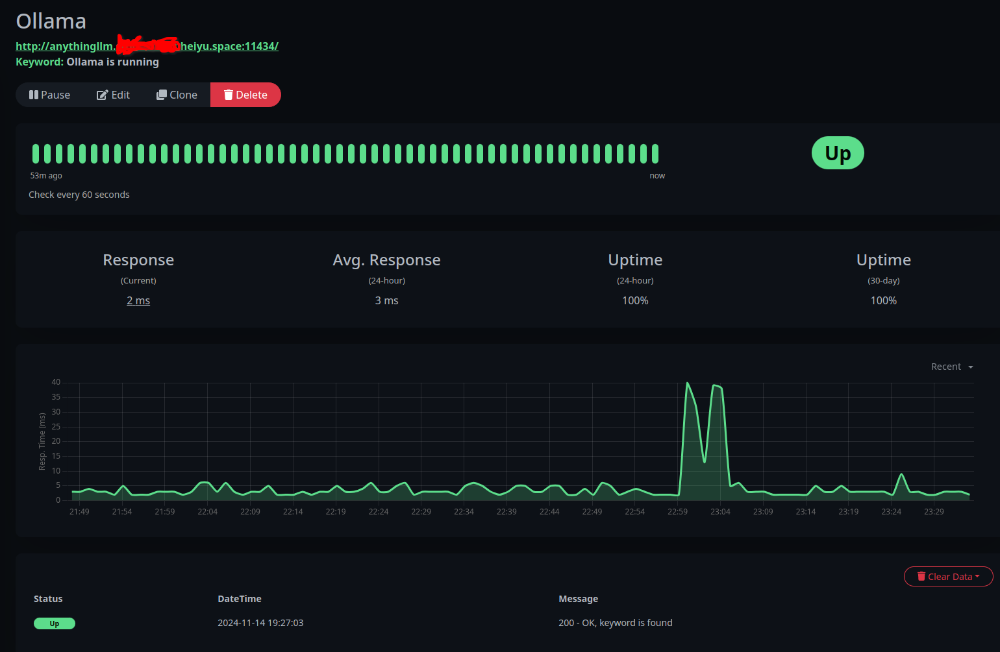

# AnythingLLM-LazyCat

## What

This project involves porting the lightweight RAG implementation of AnythingLLM + Ollama to LazyCat MicroServer. 

So, please do not expect this project to help you run this RAG implementation on platforms other than LazyCat MicroServer. 

## Dependencies

- AnythingLLM:1.2.4
- Ollama:0.4.1

## How

- How to Use AnythingLLM

    Please refer to [AnythingLLM Official Documentation](https://docs.anythingllm.com)

- How to Manage the Models with Ollama

    Please refer to [Ollama API Documentation](https://github.com/ollama/blob/main/docs/api.md)

    For example, the command below is to pull a model.

```bash
curl http://anythingllm.${YourLazyCatMicroServerName}.heiyu.space:11434/api/pull -d '{
  "name": "llama3.2"
}
```
## Recommended Configuration

Due to the LazyCat MicroServer's limited memory and CPU, it is highly not recommended to run LLMs with 10s of billions of parameters for real-time chat on the LazyCat MicroServer.

### To process the documents that do not contain any sensitive data

- Chat Model: API
- Embedding Model: API
- Vector DB: LanceDB

### To process the documents that do contain any sensitive data but are not very confidential

- Chat Model: API
- Embedding Model: Ollama - mxbai-embed-large
- Vector DB: LanceDB

### To process the documents that contain any confidential data

- Chat Model: Ollama - llama3.2
- Embedding Model: Ollama - mxbai-embed-large
- Vector DB: LanceDB

## How to Check the Status of Ollama

- Access http://anythingllm.${YourLazyCatMicroServerName}.heiyu.space:11434/ to check whether "Ollama is running" is shown.


- Alternatively, you can install and leverage the Uptime Kuma to track Ollama's status easily.


